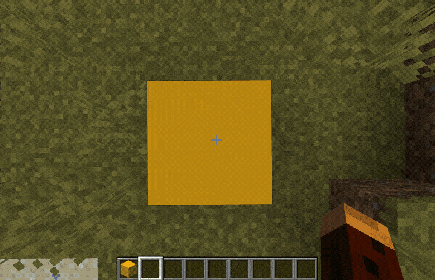
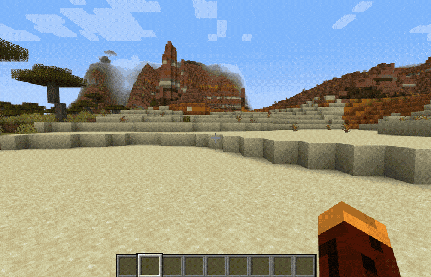

# Pathinator


Pathinator is a Minecraft plugin that allows you to easily create custom paths using the block you're standing on.

For example, if you are standing on a block of `OAK_PLANKS` and you issue a command to create a path of 50 blocks, Pathinator will replace all the blocks in the direction you are facing with `OAK_PLANKS` out to a distance of 50 blocks. If you also requested `with lights` Pathinator will add a light (_configurable, defaults to TORCH_) every N<sup>\*</sup> blocks to the side of the path.

#### Available at

- [PaperMC](https://hangar.papermc.io/HideTheMonkey/Pathinator)
- [SpigotMC](https://www.spigotmc.org/resources/pathinator.118803/)
- [Modrinth](https://modrinth.com/plugin/pathinator)

## Creative vs Survival

In Survival mode, you must have enough material in your inventory to cover the distance requested. Additionally, each relevant tool in your inventory will take 1 damage for each block you replace (_including the clearance space above if carving through a mountain_). For example, if you have a shovel and a pickaxe and you create a path 10 blocks long through 6 blocks of dirt and 4 blocks of stone, your shovel will take 6 damage and your pickaxe will take 4 damage. If you have more than one tool of the same type, Pathinator will take the damage from the tool with the least remaining durability (_taking tool damage is configurable_).

You can configure Pathinator to require the correct tools in order to automatically mine the blocks as well as retain the mined material in your inventory.

In Creative mode, you can place as many blocks of any type as you want, with no inventory restrictions or damage to tools.

## Usage

#### Basic

`path:basic <distance> [with lights]` (_aliased as `pb`_) where \<distance\> is the number of blocks to place, and [with lights] is an optional boolean `true|false` whether to place a light every N<sup>\*</sup> number of blocks.

For example: `path:basic 25 true` to create a path 25 blocks long with lights, or `path:basic 25` where [with lights] defaults to false for no lights.

#### Tracks

`path:tracks <distance> [with power] [with lights]` (_aliased as `pt`_) where \<distance\> is the number of blocks to place, and [with power] is an optional boolean `true|false` whether to place a powered rail every N<sup>\*</sup> number of blocks. [with lights] is another optional boolean whether to place a light every N<sup>\*</sup> number of blocks.

<sup>\*</sup> _N is configurable in `/plugins/Pathinator/config.yml`_

#### Custom

`path:custom <distance> <width> <height> [path material] [clearance material]` (_aliased as `pc`_) where **\<distance\>** **\<width\>** and **\<height\>** are required and **[path material]** and **[clearance material]** are optional. If no **[path material]** is specified Pathinator will detect the pattern of blocks the player is currently standing on for the path. For example: if you create a path 3 blocks wide Pathinator will detect the block under the player and one block to the left and right and keep that same pattern for the entire distance requested.

Additionally, you can specify what material to use to fill the 'air' space above the path (clearance material). This allows you to easily create 3 dimensional structures out of any material!

#### Follow

`path:follow <start|stop> [radius] [path material]` (_aliased as `pf`_) where **[radius]** is a number between 0 and 5, and **[path material]** is any solid block. **NOTE you must run `path:follow stop` to tell Pathinator to stop creating a path wherever you walk.**

For example, `path:follow start` will start following using the default radius and whatever block you are currently standing on. `path:follow start 2 minecraft:oak_planks` will create a wide path with OAK_PLANKS.

The follow command only works in Creative mode at this time.

#### Dig

`path:dig <up|down|ahead|vup|vdown> [distance]` (_aliased as `pd`_) where \<distance\> is the number of blocks away from you to dig. `path:dig` does not place any blocks, it only removes them (_and adds to your inventory when in survival_).
`up|down` will dig a stair step pattern either up or down with the default clearance height (set in config.yml).
`vup|vdown` (vertical up | vertical down) will dig straight up or down starting from one block in front of where the player is standing.

For example, `path:dig down 20` will dig a stair step pattern extending 20 blocks, starting from the block in front of the player. (1 block forward, and 1 block down)
`path:dig vup 20` will dig straight up for 20 blocks starting from the block in front of the player.

## GIF Examples

<details> 
  <summary>/path:basic</summary>
  


</details>

<details> 
  <summary>/path:tracks</summary>



</details>

<details> 
  <summary>/path:custom</summary>




</details>

<details>
    <summary>/path:follow</summary>


</details>

## Configuration

Once loaded on the server, edit `/plugins/Pathinator/config.yml` to adjust the default values.

```
clearance:
  height: 3
  material: AIR

lighting:
  interval: 12
  stack: [TORCH]

survival:
  enabled: true|false
  requireTool: true|false
  toolDamage: true|false
  keepMaterial: true|false

tracks:
  powerInterval: 34

follow:
  enabled: true|false
  radius: (0-5)

```

## Building from Source

Run `mvn clean package shade:shade` from the root directory. This will create `target/Pathinator-<version>.jar` which you can then drop in your plugins folder.

## Metrics

I use [bStats](https://bstats.org/) to collect anonymous usage data which helps me decide where to focus development effort. The metrics are publicly available [here](https://bstats.org/plugin/bukkit/Pathinator/21949).

_The metrics can be disabled in config.yml if you really want, but please consider leaving them on as this allows me to keep track of usage._

## Future Updates

- ~~Add option to create a path with rail tracks `path:tracks ...`~~ (v1.1.0)
- ~~Add option to customize aspects of the path (height, width, material, etc...) `path:custom ...`~~ (v1.2.0)
- Add option to follow the natural terrain instead of laying it all on the same Y value.
- Add permissions management with LuckPerms

## License

Pathinator is licensed under the permissive MIT license. Please see [`LICENSE`](https://github.com/HideTheMonkey/Pathinator/blob/main/LICENSE) for more info.
